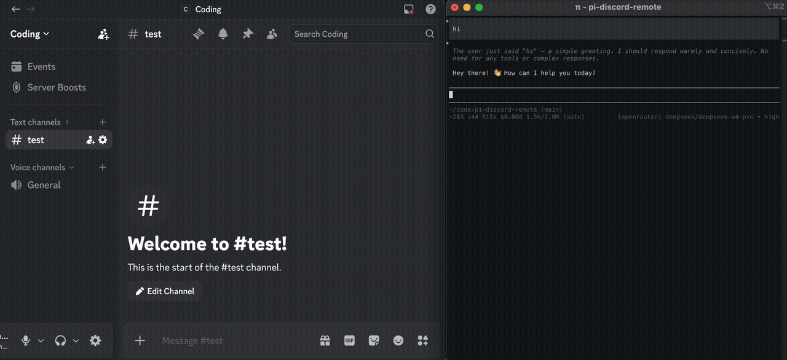

# pi-discord-remote

> Control your [Pi](https://pi.dev) coding-agent session from Discord.



Each time you run `/pi-discord-remote start`, the extension automatically creates a **new Discord text channel** named after your current project + date (e.g. `kaleidoscope-may09`). Messages sent in that channel are injected into Pi as user prompts; Pi's responses are posted back. When you stop, the channel is deleted — keeping your server clean within Discord's channel limit.

## Install

```bash
pi install npm:pi-discord-remote
```

## Bot setup

1. Create a bot at [discord.com/developers/applications](https://discord.com/developers/applications)
2. Under **Bot → Privileged Gateway Intents**, enable **Message Content**
3. Invite the bot to your server with these permissions:
   - Read Messages / View Channels
   - Send Messages
   - Add Reactions
   - **Manage Channels** ← required for auto-create/delete

## Usage

```
/pi-discord-remote setup        — configure token, server ID, optional category
/pi-discord-remote start        — create channel + connect
/pi-discord-remote stop         — delete channel + disconnect
/pi-discord-remote status       — show connection state
/pi-discord-remote open-config  — edit config JSON in Pi's editor
```

### Setup prompts

| Field | Where to find it |
|-------|-----------------|
| Bot token | Discord Developer Portal → Bot → Token |
| Guild (Server) ID | Right-click server → Copy Server ID (needs Developer Mode) |
| Category ID | Right-click a category → Copy Category ID (optional — channels go to server root otherwise) |
| Allowed user IDs | Right-click a user → Copy User ID (leave empty to allow everyone) |
| Tool responses | Send tool outputs (results/errors) to Discord alongside tool-call labels? (y/n, default: no) |

Config is stored at `~/.pi/agent/pi-discord-remote/config.json`.

## Config reference

| Key | Type | Default | Description |
|-----|------|---------|-------------|
| `token` | string | — | Discord bot token |
| `guildId` | string | — | Discord guild (server) ID |
| `categoryId` | string | — | Optional category for auto-created channels |
| `allowedUserIds` | string[] | `[]` | Allow-list of Discord user IDs (empty = everyone) |
| `reactions` | boolean | `true` | React with ⏳ while processing |
| `toolResponses` | boolean | `false` | Also post tool outputs/results alongside tool-call labels (truncated to ≤400 chars) |

Edit config with `/pi-discord-remote open-config`.

## How it works

- **`/pi-discord-remote start`** — bot logs in, creates a text channel named `<project>-<mon><dd>-<HHMM>`, and starts listening there only
- **Incoming message** — injected as a user prompt into the active Pi session; bot reacts ⏳ while Pi works, then posts the full response back
- **Tool calls** — each tool invocation is labeled (🔧 bash, 📄 read, ✏️ edit, etc.) with a detail line; if `toolResponses` is on, results follow as ↩️/❌ code blocks
- **`/pi-discord-remote stop`** (or Pi exit) — channel is deleted, bot disconnects

### `ask_user_question` → Discord

Pi's TUI-only `ask_user_question` dialog (from `@juicesharp/rpiv-ask-user-question`) is invisible over Discord remote. When Discord is connected, pi-discord-remote:

1. **Blocks** the original `ask_user_question` via `tool_call` event interception — the TUI dialog never appears
2. **Registers** `discord_ask_user_question` — a drop-in replacement that formats questions as Discord messages and collects answers from the channel
3. **Hints** the LLM via `before_agent_start` to prefer `discord_ask_user_question` when Discord is connected

When Discord **is not** connected, the original `ask_user_question` (TUI dialog) works normally as a fallback. No need to uninstall `@juicesharp/rpiv-ask-user-question` — the two extensions coexist gracefully.

## License

MIT
